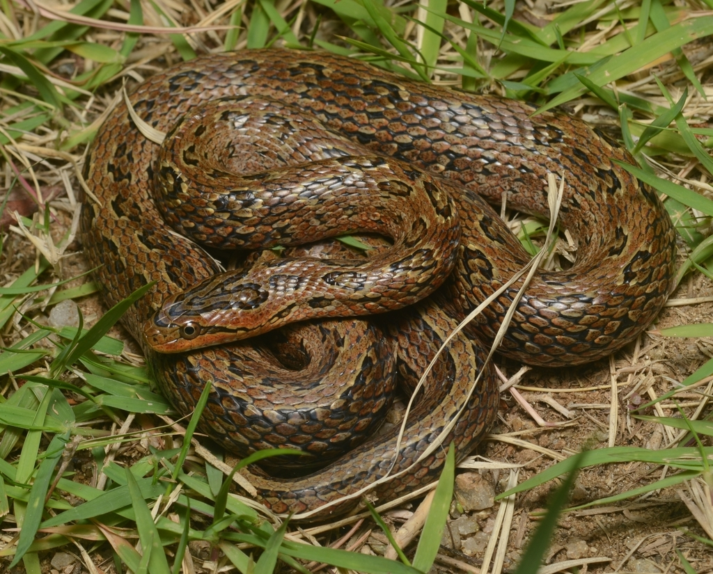

# Whole-genome assembly of the Frog-eating ratsnake (*Oocatochus rufodorsatus*)
*Oocatochus rufodorsatus* PacBio genome assembly

__*Oocatochus rufodorsatus* (AMNH 21013) collected from Chuncheon, South Korea__